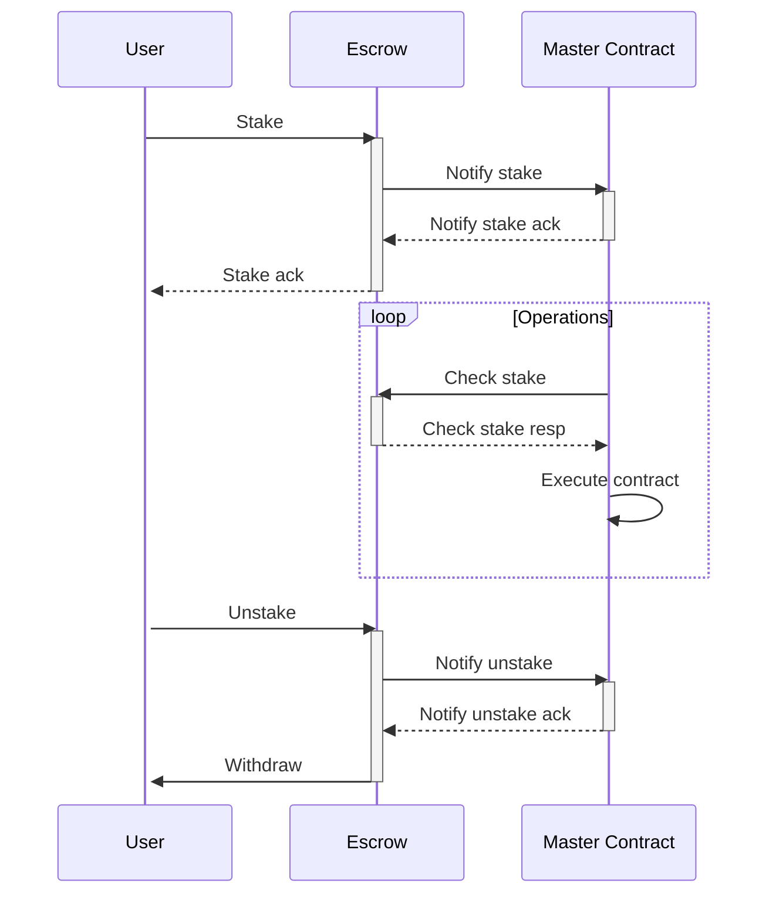
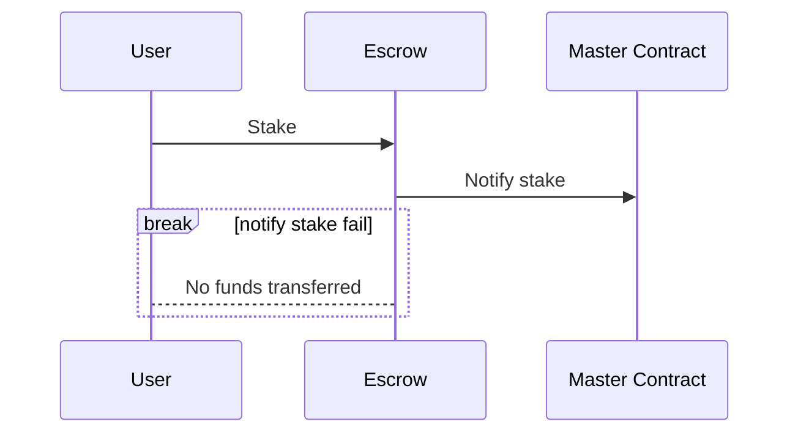
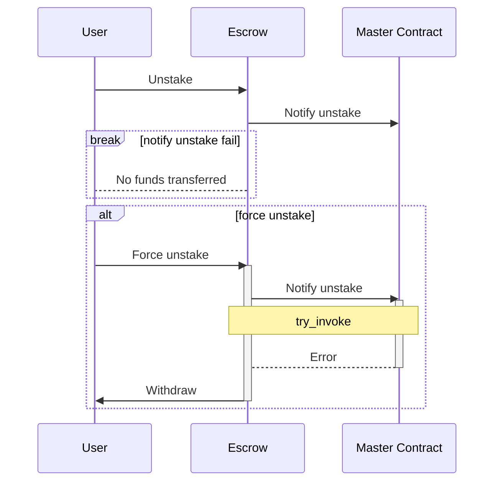

# Federated Staking

- **Team Name:** `Dot3`
- **Payment Address:** `16PGfYVyng8RNHHnJMYn2T5UMtqFXnda7r7ZNKJzbmWbcf5u`

## Project Overview :page_facing_up:
### Overview

Staking is a key component of many DeFi projects. 
While generally staking is considered on a blockchain level,
there are many applications that can utilize a smart contract to manage tokens that are not central to a given blockchain or parachain.
Some examples would include: DAOs that require staking a token to vote on disputes or DEXes which use farms to distribute additional rewards.

Solid open-source staking template will allow Ink! developers to quickly add staking incentives into their projects.
Moreover, the architecture guarantees the safety of user funds.
The presented approach is far superior to a typical staking which holds all the funds in a single contract.
We firmly believe that this template will greatly enhance security of future Ink! based DeFi projects and will be a valuable addition to the Ink! ecosystem.

### Ink! Ecosystem Impact

The major advantage of Ink! smart contracts over Solidity on Ethereum is that smart contracts can utilize code caching.
With this, it is very efficient to create many smart contracts using the same bytecode.
In this project we showcase an excellent approach to splitting core contract logic and user finances.
This approach offers steadfast security compared to a typical staking contract.
By creating this open-source Ink! example we believe that the ecosystem at large will benefit from a secure staking solution.
This will save upcoming projects plenty of development time and will allow to allocate resources towards other project goals.

### Project Details

The key component of the Federated staking architecture is the separation of user funds from the core staking logic.
This is achieved by creating a master contract which holds all the staking logic and a separate escrow contracts which hold the user funds.
With this approach, the master staking contract can be modified and adjusted to specific use cases without compromising user funds.

In order to minimize the attack surface or chance for an error in code, core part of `Federated Staking` - `Escrow` will be a very simple contract.

Allowances of ERC-20 tokens are not required, so the user is completely protected from any attack vector coming from excess allowance for the staked token.

To initialize `Escrow` binary, address of `Master Contract` and `ERC-20 token` are required. After initialization user sends tokens to `Escrow`'s address. Afterwards the user notifies the `Escrow` that funds are deposited. From this moment `Master Contract` operates normally - executes its business logic. With the ability to check the code hash, the master contract can be sure, that the escrow can't act maliciously.

#### Edge cases
##### Fail to notify on stake

##### Unstake in case of `Master Contract` failure
If `Notify unstake` fails to be processed by `Master Contract`, the user is still able to withdraw funds with `Force unstake`. This approach guarantees the possibility to withdraw funds even in the event of `Master Contract`'s internal error. By making this call, the user will forfeit all pending rewards.

#### Data model
##### Master contract
Contains all the information required to keep track of staked user funds and rewards in a per-user mapping:
- reward per token
- staked
- accrued reward
- claimed reward
- escrow address

As well as global information:
- total staked
- total rewards
- last reward per token
- staked asset address
- reward asset address
- expiration date

It will be easy to extend this model to include an array of possible reward assets, but is out of scope for this project.
The design is intended to be flexible in that the rewards algorithm must be adapted to the specific use case.
The implemented algorithm will have a fixed reward amount distributed over a fixed period of time, but we intend the reward calculation function to be easy to substitute.
This comes to attention when considering use cases that would require a fixed APR for rewards.

##### Escrow
The escrow stores:
- the address of its owner
- the master contract address
- the staked asset address

#### Audit
We believe that an audit won't be necessary, as calling escrow methods can only be done by the owner, therefore the user funds are safe at all times.
Any exploit of the master contract could only affect the deposited rewards for staking (which would be worth significantly less than the staked tokens).

#### Category
Canary Dapp

## Team :busts_in_silhouette:

### Team members

- Marek Bednarek
- Łukasz Ptak

### Contact

- **Contact Name:** Łukasz Ptak
- **Contact Email:** lukasz@dot3.dev
- **Website:** https://dot3.dev

### Legal Structure

- **Registered Address:** In progress
- **Registered Legal Entity:** In progress

### Team's experience

The team's experience spans across multiple industries and technologies.
We have a significant blockchain experience with Rust and CosmWasm over the past two years as well as Solidity/EVM and Algorand.
Our team members have contributed to open source blockchain projects, including core repositories of Algorand such as [PyTEAL](https://github.com/algorand/pyteal).

More information about our team can be found in the [Team LinkedIn Profiles](#team-linkedin-profiles) section as well as the [Dot3 Website](https://www.dot3.dev).

### Team Code Repos

Private repositories of previous Rust/CosmWASM projects are available, but cannot be shared publicly.

Team GitHub accounts:

- https://github.com/Tragel
- https://github.com/StylishTriangles

### Team LinkedIn Profiles

- https://www.linkedin.com/in/marek-bednarek-3076904b/
- https://www.linkedin.com/in/%C5%82ukasz-ptak-166535167/

## Development Status :open_book:

- Planning complete, ready to create solution

## Development Roadmap :nut_and_bolt:

### Overview

- **Total Estimated Duration:** 1.5 months
- **Full-Time Equivalent (FTE):**  1
- **Total Costs:** 16,000 USD

### Milestone 1 — Full federated staking smart contract suite

- **Estimated duration:** 1.5 months
- **FTE:**  1
- **Costs:** 16,000 USD

| Number | Deliverable | Specification |
| -----: | ----------- | ------------- |
| **0a.** | License | Apache 2.0 |
| **0b.** | Documentation | We will provide both **inline documentation** of the code and a basic **tutorial** that explains how a developer can amend functionality inside the smart contract to build the , which will show how the new functionality works. |
| **0c.** | Testing and Testing Guide | Core functions will be fully covered by comprehensive unit tests to ensure functionality and robustness. In the guide, we will describe how to run these tests. |
| **0d.** | Docker | We will provide a Dockerfile(s) that can be used to test all the functionality delivered with this milestone. |
| 0e. | Article | We will publish an blog post on our website that explains the idea of Federated Staking and its benefits |
| 1. | Smart contract: Master Staking Contract | We will deliver a main staking contract which will allow for share allocation and reward distribution. |
| 2. | Smart contract: Escrow App | We will deliver an escrow contract which will allow for safe locking of user funds. This will be coupled with the master staking contract, but will guarantee safety of funds even if main staking contract is compromised |

## Additional Information :heavy_plus_sign:

**How did you hear about the Bounty Program?** personal recommendation
