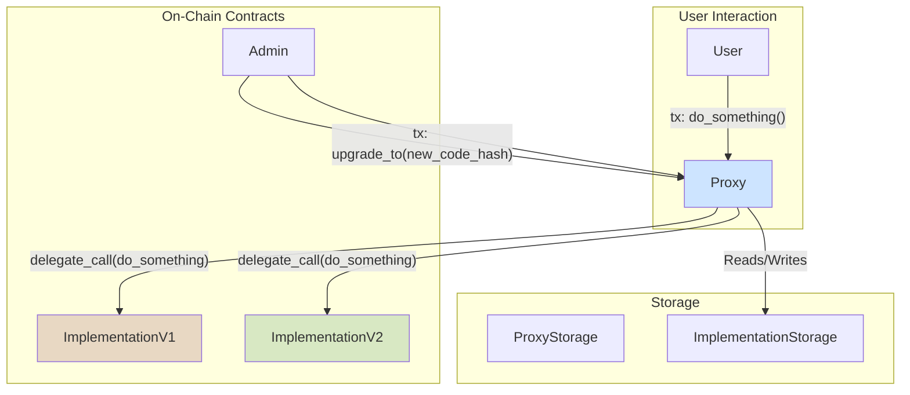

# ink-kit Contracts: A Foundational Standard Library for ink! v6

**Team Name:** Chainscore Private Limited  
**Payment Address:** TBA

## Project Overview :page_facing_up:

### Overview

ink-kit contracts is a library of secure, modular, and reusable smart contract components for ink! v6, designed to be the OpenZeppelin of the Polkadot ecosystem.

This proposal outlines the development of ink-kit, a foundational, open-source library of standard smart contract primitives for ink! v6. This initiative directly addresses the critical gap left by the discontinuation of support for OpenBrush and Pendzl for the latest versions of ink!, which currently forces developers to write high-stakes, boilerplate code from scratch. ink-kit will fill this gap by providing a suite of audited, efficient, reusable components built with a Rust-idiomatic, trait-first, and macro-powered architecture. This approach, inspired by the success and philosophy of OpenZeppelin in the EVM world, will drastically reduce development time, improve the baseline security of all ink! dApps, and foster a more mature and collaborative development environment.

The project falls under the **Infrastructure** category. Just as OpenZeppelin became indispensable for secure Solidity development, ink-kit will become the bedrock for the next generation of Polkadot smart contracts, ensuring they are secure, interoperable, and built on a solid foundation. The team at Chainscore Labs specializes in building core blockchain infrastructure, having observed the evolution of ink!, the team recognizes that the launch of v6 is a pivotal moment. The absence of a standard library is the single largest impediment to its adoption and the development of a robust dApp ecosystem.

## ink! Ecosystem Impact

ink-kit will benefit the ink! ecosystem by lowering the barrier to entry, establishing a baseline of security, fostering composability, and de-risking contract upgrades.

Currently, a new ink! developer must not only learn the language but also implement complex and security-critical logic from scratch. This includes token standards, access control, and reentrancy guards. ink-kit will provide these components out-of-the-box, allowing developers to focus on their unique application logic. This mirrors how OpenZeppelin's ERC20 and ERC721 implementations accelerated the growth of DeFi and NFTs on Ethereum. By providing canonical implementations of ERC20 and ERC721, developers will be able to launch token projects in hours, not weeks.

Smart contract security is paramount. OpenZeppelin's success is built on its reputation for providing audited, community-vetted code. ink-kit will bring this security-first mindset to ink!. By providing standardized, heavily tested implementations of patterns like ReentrancyGuard, Pausable, and Ownable, the library will help prevent entire classes of common vulnerabilities across the ecosystem. This will build trust among users and attract more risk-averse capital and enterprise adoption to the Polkadot smart contract ecosystem.

A key benefit of a standard library is that it creates a common language for contracts to speak. When all projects use the same ERC20 trait from ink-kit, a decentralized exchange can integrate any new token with zero friction. This creates powerful network effects. The library will be designed with the new Solidity ABI compatibility of ink! v6 in mind, ensuring that the components can serve as a bridge, promoting seamless interaction between the native ink! and burgeoning EVM-compatible parts of the ecosystem.

Contract upgrades are one of the most dangerous operations a development team can perform. The ink! v6 documentation provides the low-level primitives (`delegate_call`, `set_code_hash`) but no standardized, safe patterns. This is a major risk for the ecosystem. A core component of ink-kit will be a reusable, audited proxy pattern implementation, inspired by OpenZeppelin's proven models. This will provide a clear, safe path for projects to upgrade their logic and fix bugs, which is essential for long-term project viability and security.

The existence of a standard library like ink-kit will also act as a catalyst for the broader tooling and educational landscape. A standard library creates predictable code patterns; for instance, how ownership is transferred or how a contract is paused will follow a consistent implementation. This predictability allows static analysis tools to be built to specifically recognize these patterns, such as a linter that could verify if a critical function is correctly protected by ink-kit's Ownable::only_owner modifier. Furthermore, educational content like tutorials and workshops becomes easier to create and more effective. Instead of teaching low-level storage manipulation for a token, a tutorial can begin with use ink_blueprint::tokens::ERC20::ERC20;, significantly accelerating the learning curve for new developers. This foundational layer enables and accelerates the development of a mature ecosystem of security tooling, developer tools, and educational resources, creating a positive feedback loop that strengthens the entire ink! ecosystem.

## Project Details

### Core Architecture & Design Philosophy: A Trait-First, Macro-Powered Approach

The implementation strategy is designed to be idiomatically Rust, leveraging the language's most powerful features to provide an API that is simultaneously safe, flexible, and easy to use. The project will explicitly avoid a direct port of Solidity's inheritance-based model, which is ill-suited for Rust's design principles.

Core functionalities will be defined as ink! traits. For example, a Pausable trait will be defined with `paused()`, `pause()`, and `unpause()` methods. This separation of the interface from the implementation promotes loose coupling and better testability, aligning with ink!'s own patterns for cross-contract calls, which are often based on trait definitions.

```rust
// Example: Defining the Pausable behavior as a trait
#[ink::trait_definition]
pub trait Pausable {
    #[ink(message)]
    fn paused(&self) -> bool;

    #[ink(message)]
    fn pause(&mut self);

    #[ink(message)]
    fn unpause(&mut self);
}
```

The true power of this approach comes from procedural macros. Instead of forcing developers to manually implement these traits, the library will provide derive macros that automatically generate the required storage fields and method implementations. This achieves the simplicity of Solidity's inheritance (e.g., is Pausable) while using Rust's superior composition model. This design is inspired by the Rust-based OpenZeppelin Stellar Soroban Contracts, which also utilize procedural macros for similar purposes. It leverages the same underlying compiler technologies (syn, quote, proc-macro2) that power ink! itself, ensuring seamless integration.

```rust
// Example: A dev's contract using ink-kit
use ink_kit::contracts::access::Ownable;
use ink_kit::contracts::utils::Pausable;

#[ink::contract]
pub mod my_contract {
    #[ink(storage)]
    # // Deriving behavior
    pub struct MyContract {
        // Derive macros automatically add necessary fields,
        // e.g., `owner: AccountId` from Ownable
        // and `paused: bool` from Pausable.
    }

    impl MyContract {
        #[ink(constructor)]
        pub fn new() -> Self {
            let mut instance = Self::default();
            // The Ownable macro provides this initializer
            instance._init_owner(Self::env().caller());
            instance
        }

        #[ink(message)]
        pub fn do_something(&mut self) {
            // The Pausable macro provides this modifier-like check
            self.ensure_not_paused();
            //... logic...
        }
    }

    // The derive macros also generate the trait implementations automatically.
    // impl Ownable for MyContract {... }
    // impl Pausable for MyContract {... }
}
```

This macro-based architecture is a fundamentally more secure and maintainable approach for a standard library. A common issue with complex inheritance in Solidity is the difficulty in tracing the origin of specific functions or state variables, which can lead to unexpected behavior or upgrade hazards. With this macro-based approach, the implementation logic is generated at compile time and "stamped" directly into the contract's code, eliminating complex inheritance chains and making the code easier to audit. The macros can be designed to generate internal helper functions that cannot be accidentally overridden by developers, thus preserving the security invariants of the component. When a component in ink-kit is updated, developers simply need to update the library version in their Cargo.toml and recompile, providing a much cleaner and safer upgrade path for propagating security fixes throughout the ecosystem.

## Modular Components of ink-kit

The library will be structured into following logical modules:

### Tokens (/tokens)

- **ERC20 (Fungible Token):** A canonical implementation of the ERC20 standard.
  - Core: **ERC20** (trait definition and implementation).
  - Extensions: Modular traits and macro-driven implementations for 
    - **ERC20Metadata**: extension to include name, symbol and decimals fns
    - **ERC20Burnable**: allows desturuction of own tokens
    - **ERC20Pausable**: ability to pause token transfers
    - **ERC20Capped**: enforces a cap on minting of the tokens upto total supply
    - **ERC20FlashMint**: allows flashloans of tokens to be minted and burned
    - **ERC20Permit**: gasless approval of tokens 
    - **ERC20Votes**: support for voting and vote delegation
    - **ERC20Bridgeable**: ERC-7802 compatibility for crosschain bridges
- **ERC721 (Non-Fungible Token):** A canonical implementation of the ERC721 standard
  - Core: **ERC721** (trait definition and implementation).
  - Extensions: 
    - **ERC721Metadata**: adds `name`, `symbol` and `token_uri` fns
    - **ERC721Pausable**: ability to pause contract operations
    - **ERC721Burnable**: allows destruction of own tokens
    - **ERC721Enumerable**: allows enumerating the tokens on-chain
    - **ERC721URIStorage**: provides a way to store and manage token URIs separately for each token ID
    - **ERC721Votes**: support for voting and vote delegation based on token ownership
    - **ERC721Royalty**: enables royalty payments on token transfers, following standards like EIP-2981

- **ERC1155 (Multi-Token):** A canonical implementation of the ERC1155 standard for multi-token contracts.
  - Core: **ERC1155** (trait definition and implementation).
  - Extensions:
    - **ERC1155Metadata**: adds URI support for token metadata
    - **ERC1155Pausable**: ability to pause contract operations
    - **ERC1155Burnable**: allows destruction of own tokens
    - **ERC1155Supply**: tracks total supply for each token ID

### Access Control (/access)

This directory provides ways to restrict who can access the functions of a contract or when they can do it.

- **AccessManager:** A full-fledged access control solution for smart contract systems. Allows creating and assigning multiple hierarchical roles with execution delays for each account across various contracts.
- **AccessManaged:** Delegates its access control to an authority that dictates the permissions of the managed contract. It’s compatible with an AccessManager as an authority.
- **AccessControl:** Provides a per-contract role-based access control mechanism. Multiple hierarchical roles can be created and assigned each to multiple accounts within the same instance.
- **Ownable:** A simpler mechanism with a single owner "role" that can be assigned to a single account. This simpler mechanism can be useful for quick tests but projects with production concerns are likely to outgrow it.

### Utilities (/utils)

- **Pausable:** A utility to halt contract functionality in case of an emergency.
- **ReentrancyGuard:** A modifier-like pattern to prevent re-entrancy attacks.
- **Cryptography:** Helpers for common cryptographic operations like signature verification.
- **Multicall:** A utility to batch multiple calls into a single transaction.
- **PaymentSplitter**: Split native amount between participants
- **TimelockController**: Execute txs with some delay

### Upgradeability (/proxy)

- **UpgradeableProxy:** A standardized proxy contract using delegate_call to forward all calls to a logic contract (implementation), storing the code_hash of the implementation in its own storage.
- **Proxy Admin:** The proxy will feature separate admin logic to manage upgrades, preventing the implementation contract from controlling the upgrade process itself—a critical security pattern derived from OpenZeppelin's models.

#### Proxy Architecture Diagram:



This diagram illustrates how a user's call to the Proxy contract is executed using the code from an Implementation contract, but within the storage context of the Proxy. An Admin can update the implementation_code_hash in the Proxy's storage to point to a new version of the implementation code.

## Technology Stack & Security

- **Language/Framework:** ink! v6.0.0 (or latest stable alpha/beta).
- **Tooling:** cargo-contract v6.0.0 (or latest), ink-node for local testing.
- **Testing:** Comprehensive unit tests for every module. End-to-end (E2E) integration tests using ink_e2e to simulate real-world usage scenarios.
- **Security Posture:** Security is the highest priority. The project will follow the "Checks-Effects-Interactions" pattern, provide thorough documentation, and maintain a SECURITY.md file for vulnerability disclosure, inspired by OpenZeppelin. While a formal audit is outside the scope of this initial budget, the library will be architected to be "audit-ready."

### What the project is not

This project will not provide off-chain tooling like the OpenZeppelin Upgrades Plugins for Hardhat/Foundry. The focus is on delivering essential on-chain primitives.

This project will not provide a frontend application or a dApp development framework.

This project will not cover deployment costs, maintenance of deployed contracts (other than the library itself), or business-oriented activities.

**CATEGORY:** Infrastructure

## Team :busts_in_silhouette:

### Team members

- **Team Members:** Kartik Gupta, Harsh Arora, Dikshant Singh

All team members are core developers for [Tessera](https://github.com/Chainscore/tessera-releases/releases), our JAM client implementation, and have deep understanding of Polkadot and decentralized computing architetcure. Our experience implementing JAM, PolkaVM, cryptographic libraries and building smart contracts for last 4+ years puts us in strong position to implement this.

### Contact

- **Contact Name:** Prasad Kumkar
- **Contact Email:** prasad@chainscore.finance
- **Website:** https://chainscore.finance/en

### Legal Structure

- **Registered Address:** S.NO 320/1. D-16, Vignahar Sankul, Narayangaon, Pune, India [410504]
- **Registered Legal Entity:** Chainscore Private Limited (GSTIN 27AAKCC2307B1Z6)

### Team's experience

Chainscore Labs is a Web3 Research and Development firm specializing in blockchain infrastructure, Rust, TypeScript, and full-stack Web3 development. The team members have extensive experience building Substrate-based solutions, decentralized applications, and ecosystem tooling, uniquely positioning them to deliver and maintain ink-kit as robust Polkadot infrastructure.

The team's background as W3F Grant Recipients and alumni of the Polkadot Blockchain Academy (PBA) demonstrates a deep commitment and proven capabilities within the Polkadot ecosystem. Their work on complex, low-level infrastructure projects showcases expertise in the areas required for this grant:


- **Tessera**: JAM client implementation in Python
- **Tsrkit-PVM**: Interpreter and Recompiled version of PVM (Polkadot Virtual Machine) implementation in Python and Cython
- **DA Research** (Supported by W3F Grants Program): Research collaboration with W3F to benchmark Polkadot's DA Layer (ELVES) against modular DA solutions like Espresso, Avail, NEAR and Celestia
- **JAMC**: C-based SDK for JAM
- **DotRing** (Supported by Polkadot Open Source Grants Program): Suite of cryptographic libraries impl 20+ Elliptic Curves, 40% efficient Bandersnatch operations, IETF and Pedersen VRF, W3F Ring Proof and Fiat Shamir Transcript


The team's deep familiarity with Rust's paradigms, gained through these projects, is essential for delivering the proposed idiomatic, macro-powered architecture for ink-kit.

### Team Code Repos

- **Organization GitHub:** https://github.com/chainscore 
- **Previous Projects:**
  - https://github.com/Chainscore/tessera-releases/releases
  - https://github.com/chainscore/dot-ring
  - https://github.com/chainscore/tsrkit-pvm
  - https://github.com/chainscore/jamc

### Team GitHub Profiles

- **Kartik Gupta:** https://github.com/Kartik213
- **Harsh Arora:** https://github.com/harsh-csl
- **Dikshant Singh:** https://github.com/dikshant441-chainscore

### Team LinkedIn Profiles

- **Kartik Gupta:** https://www.linkedin.com/in/kartikgupta02
- **Harsh Arora:** https://www.linkedin.com/in/harsharora1205
- **Dikshant Singh:** https://www.linkedin.com/in/dikshant-singh/

## Development Status :open_book:

This proposal marks the formal beginning of the ink-kit project. While no code has been written, this document is the result of extensive preliminary research into the ink! v6 framework, its breaking changes from v5, the architecture of OpenZeppelin's libraries across multiple languages (Solidity, Cairo, Stellar), and the current state of token standards within the Polkadot ecosystem. The design choices and implementation plan are firmly grounded in this research.

## Development Roadmap :nut_and_bolt:

### Overview

- **Total Estimated Duration:** 3 Months
- **Full-Time Equivalent (FTE):** 3
- **Total Costs:** $48,000 USD

### Milestone 1: Core Infrastructure, Access Control & ERC20 Implementation

- **Estimated duration:** 1 month
- **FTE:** 3
- **Costs:** $18,000 USD

| Number | Deliverable | Specification |
|--------|-------------|---------------|
| 0a. | License | MIT |
| 0b. | Documentation | Comprehensive inline documentation (rustdoc) will be provided for all public traits, structs, and functions. A basic README.md will explain the project structure and setup. |
| 0c. | Testing and Testing Guide | Core logic for all modules will be covered by unit tests. The testing guide will detail how to run the full test suite using cargo test. |
| 0d. | Docker | A Dockerfile will be provided to set up a consistent build and test environment, including the correct Rust toolchain and cargo-contract version. |
| 1. | Project Scaffolding & CI | A public GitHub repository will be created under the Chainscore organization. A CI pipeline using GitHub Actions will be set up to run clippy, rustfmt, and the test suite on every push. |
| 2. | Core Architectural Macros | The foundational procedural macros for the # pattern will be implemented, establishing the core architecture for adding behavior to contracts. |
| 3. | Access Control Module | Implementation of the Ownable, AccessControl, AccessManager, and AccessManaged traits and their corresponding derive macros. This includes logic for ownership transfer, role management, hierarchical roles, execution delays, and delegation to authorities. |
| 4. | ERC20 Fungible Token Module | A full implementation of the ERC20 standard, including the ERC20Metadata extension. This will be delivered as a trait and a derive macro for easy integration. |
| 5. | ERC20 Extensions | Implementation of Mintable, Burnable, Capped, Pausable, FlashMint, Permit, Votes, and Bridgeable extensions for the ERC20 module, each with its own trait and macro, designed to compose cleanly with the AccessControl module. |

### Milestone 2: ERC721, ERC1155, ERC6909, & Utilities

- **Estimated Duration:** 1 month
- **FTE:** 3
- **Costs:** $18,000 USD

| Number | Deliverable | Specification |
|--------|-------------|---------------|
| 0a. | License | MIT |
| 0b. | Documentation | Inline documentation for all new modules will be provided. The project's main README.md will be updated with usage examples for the new components. |
| 0c. | Testing and Testing Guide | Unit and integration tests for all new modules will be written. The testing guide will be updated as needed. |
| 0d. | Docker | The Dockerfile will be maintained to reflect any new dependencies. |
| 1. | ERC721 Non-Fungible Token Module | A full implementation of the ERC721 standard, including ERC721Metadata, will be delivered as a trait and a corresponding derive macro. |
| 2. | ERC721 Extensions | Implementation of Mintable, Burnable, Pausable, Enumerable, URIStorage, Votes, and Royalty extensions for the ERC721 module will be provided. |
| 3. | ERC1155 Multi-Token Module | A full implementation of the ERC1155 standard, including ERC1155Metadata, will be delivered as a trait and a corresponding derive macro. |
| 4. | ERC1155 Extensions | Implementation of Pausable, Burnable, and Supply extensions for the ERC1155 module will be provided. |
| 5. | ERC6909 Compact Multi-Token Module | A full implementation of the ERC6909 standard, including ERC6909Metadata, will be delivered as a trait and a corresponding derive macro. |
| 6. | ERC6909 Extensions | Implementation of Burnable, Pausable, and Votes extensions for the ERC6909 module will be provided. |
| 7. | Utilities Module | Implementation of Pausable, ReentrancyGuard, Cryptography, Multicall, PaymentSplitter, and TimelockController traits and derive macros. |
| 8. | Example Contracts | At least two example contracts (e.g., a standard MyToken and MyNFT) will be created within the repository to demonstrate how to compose the library's components. |

### Milestone 3: Upgradeability, Documentation & Launch

- **Estimated Duration:** 1 month
- **FTE:** 2
- **Costs:** $12,000 USD

| Number | Deliverable | Specification |
|--------|-------------|---------------|
| 0a. | License | MIT |
| 0b. | Documentation | A comprehensive tutorial-style documentation site (e.g., using mdBook) will be created to guide developers through using every component of ink-kit. |
| 0c. | Testing and Testing Guide | E2E tests will be written for the upgradeability pattern, simulating a full proxy deployment and upgrade cycle. The testing guide will be finalized. |
| 0d. | Docker | The Dockerfile will be finalized for the v1.0.0 release. |
| 0e. | Article | A detailed technical article will be published on a platform like Medium or the Polkadot forum, introducing ink-kit to the community and explaining its architecture. |
| 1. | Upgradeability Module | A well-tested and documented UpgradeableProxy contract that uses the delegate_call mechanism available in ink! v6 will be delivered, including Proxy Admin functionality. |
| 2. | Final Code Polish & Release | A final review of the entire codebase will be performed to ensure consistency and quality. Version 1.0.0 of all crates will be published to crates.io. |
| 3. | Project Handover & Maintenance Plan | A final report summarizing the project and a document outlining the 12-month maintenance and support plan will be provided. |

## Future Plans

Upon successful completion of the grant, Chainscore Labs is committed to the long-term success and maintenance of ink-kit.

### 12-Month Maintenance & Support

As specified, 12 months of active maintenance will be provided from the v1.0.0 launch. This includes responding to and fixing any reported bugs, keeping the library up-to-date with new stable releases of the ink! framework, and providing developer support through GitHub issues.

### Community Engagement & Growth

The team plans to actively engage with the ink! community to gather feedback and identify needs for new components. This could include modules for governance, more complex DeFi primitives, or other utilities requested by the ecosystem.

### Path to Community Governance

The long-term vision is for ink-kit to become a true community-owned public good. After the initial maintenance period, models for transitioning the governance of the library to a community-led process will be explored to ensure its longevity and alignment with the ecosystem's evolving needs.

## Additional Information :heavy_plus_sign:

### How did you hear about the Bounty Program?

Personal recommendation and active monitoring of the Polkadot ecosystem's grant programs. As a team part of a Web3 Foundation grant, Chainscore Labs is deeply integrated into the Polkadot funding and development ecosystem. The team's previous work on foundational infrastructure like the JAM client implementation (Tessera) and cryptographic libraries (DotRing) has provided a unique perspective on the challenges and opportunities in building core components for the network. This experience in delivering complex, security-critical Rust projects makes the team uniquely qualified to undertake the development of ink-kit and ensure it meets the high standards required of a foundational library. The team is confident in its ability to deliver a product that will significantly benefit the entire ink! and Polkadot community.