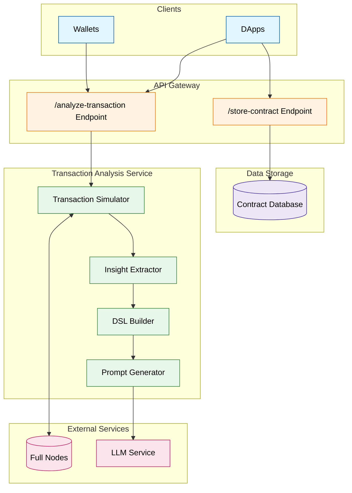

# Inkscope Transaction Analyzer

- **Team Name:** Inkscope
- **Payment Address:** 13mMCgidf4fdevVBCENS4U3pdQKLzcFQiZEMjuGTVrTJg1tE (USDC on Asset Hub)

## Project Overview :page_facing_up:

### Overview

#### Project Description

We propose developing a tool for the ink! ecosystem that analyzes transactions and generates clear and concise summaries.
This system will provide users with clear, human-readable explanations of transaction outcomes before on-chain execution, improving security and user experience.

Our approach involves emulating transactions, processing the results, and generating explanations using a large language model (LLM). The system will be available as an endpoint that DApps and wallets can integrate to transparently explain pending transactions to users.

#### Category & Importance

Our project fits within the Infrastructure category, focusing on improving the Web3 user experience within the ink! ecosystem. It addresses a key challenge: the disconnect between raw transaction data and user expectations. By bridging this gap, we empower users with better tools to understand their transactions, reducing scams, honeypots, and unintended interactions.

#### Relation to the ink! Ecosystem

The ink! ecosystem allows permissionless deployment of smart contracts, meaning users may interact with arbitrary and unfamiliar code. Unlike more restrictive environments, this openness increases the complexity of understanding transaction behavior, making it difficult for users to anticipate outcomes. Our project addresses this challenge by providing a tooling infrastructure that helps users decode and interpret transactions before execution. By simulating transactions, analyzing their effects, and generating human-readable explanations, we empower users to make informed decisions, improving security and usability within the ink! ecosystem.

#### Why We Are Building This

We are deeply concerned about the lack of transparency in blockchain transactions. Simple users often struggle to understand what a transaction will do before commiting it. By providing clear, AI driven explanations, we aim to:
- Improve user sovereignty by making transaction intent transparent.
- Increase security by helping users detect scams and unintended actions.
- Enhance adoption by making the ink! ecosystem more accessible.

Our solution allows DApps to offer clearer transaction insights and enables wallets to independently explain transactions—even without DApp support. By leveraging open-source principles in Web3, we ensure that every user can benefit from a safer, more intuitive blockchain experience.

### Ink! Ecosystem Impact

As Polkadot Blockchain Academy alumni and active supporters of the ecosystem’s growth, we believe security must remain a top priority, even as decentralized technologies continue to evolve and disrupt traditional systems. While still in its early stages, Polkadot’s high level of composability and flexibility introduces new attack vectors that require proactive defenses.

Our transaction analyzer empowers ink! users by providing clear, natural-language explanations of their transactions before execution. This is a critical step toward realizing the Web3 vision, where users interact with the blockchain with minimal trust assumptions, fully understanding how transaction execution aligns with their intent.

We envision these tools becoming fundamental components of the ecosystem. By open-sourcing this essential security infrastructure, we aim to drive broader adoption and contribute to a safer, more transparent experience for the next generation of users and applications.

A secure ecosystem should be accessible to all, regardless of technical expertise. By equipping users with the means to understand the implications of their actions, we can help them make better decisions—ultimately strengthening security across the entire ecosystem.

### Project Details

#### Data Models / API Specifications

The project will operate as a backend service, running full nodes of multiple parachains to efficiently emulate transactions. Accurate transaction analysis requires full execution within the network’s context, the system must quickly simulate transactions while ensuring correctness. The external-facing API will include the following endpoints: 

- **/explain(network, sender, tx)** 
    Produces a natural-language explanation of the transaction being executed on the specified parachain.
    Internally, the backend will attempt to retrieve and verify the source code of all involved ink! contracts. If verification is not possible, the system will return an error. 

- **/upload-code(codehash, sourcecode)**
    To enhance contract analysis, we will also provide an additional endpoint for dApps and wallets to supply verified contract information:
    Registers the source code for a given contract code hash. The system will validate and verify the submission using cargo-contract. This design ensures transparency and security by requiring verified source code, allowing users to gain reliable insights into their transactions.

#### Technology Stack Overview

This project utilizes Docker for containerization, OpenAPI for API definitions, and Typescript for backend processing. Blockchain network nodes will facilitate real-time transaction analysis.

Key components include:

- API Gateway: Exposes endpoints like /analyze-transaction and /store-contract for DApps and wallets to interact with.
- Transaction Analysis Service: Includes modules like the Transaction Simulator, Insight Extractor, DSL Builder, and Prompt Generator to process and generate transaction insights.
- External Services: Integrates with Full Nodes for transaction data and an LLM service to generate human-readable explanations.
- Data Storage: Utilizes a contract database for storing contract-related data.

#### Core Components, Protocols, Architecture

The transaction analysis system consists of several key components, each responsible for handling different stages of transaction processing, analysis, and explanation. The architecture is structured as follows:



#### PoC/MVP

**Example: Flipper Contract Transaction Analysis**

This example demonstrates how the Inkscope Transaction Analyzer would process and explain a transaction interacting with a simple Flipper contract.

1. Dapp uploads the contract source code and metadata to the analyzer. The analyzer verifies the source code and metadata, ensuring the contract is safe to analyze.

    POST /upload-code
    ```json
    {
        "codehash": "0x...",
        "sourcecode": "Contract Source Code", // This will be uploaded in a format defined later
    }
    ```

    **Contract Source Code**

    ```rust
    #![cfg_attr(not(feature = "std"), no_std, no_main)]

    #[ink::contract]
    mod flipper {

        /// Defines the storage of your contract.
        /// Add new fields to the below struct in order
        /// to add new static storage fields to your contract.
        #[ink(storage)]
        pub struct Flipper {
            /// Stores a single `bool` value on the storage.
            value: bool,
        }

        impl Flipper {
            /// Constructor that initializes the `bool` value to the given `init_value`.
            #[ink(constructor)]
            pub fn new(init_value: bool) -> Self {
                Self { value: init_value }
            }

            /// Constructor that initializes the `bool` value to `false`.
            ///
            /// Constructors can delegate to other constructors.
            #[ink(constructor)]
            pub fn default() -> Self {
                Self::new(Default::default())
            }

            /// A message that can be called on instantiated contracts.
            /// This one flips the value of the stored `bool` from `true`
            /// to `false` and vice versa.
            #[ink(message)]
            pub fn flip(&mut self) {
                self.value = !self.value;
            }

            /// Simply returns the current value of our `bool`.
            #[ink(message)]
            pub fn get(&self) -> bool {
                self.value
            }
        }
    }
    ```

2. Dapp submits the raw tranasaction to the analyzer before submitting it to the network:

    POST /analyze-tx
    ```json
    {
        "network": "WS_URL",
        "sender": "SENDER_ADDRESS",
        "tx": "0x4606001a02930cb0e98cf75f32ff43bdedf1e54767a53075b799297f640c7e9d12ba5e008eb1902a5e220100010010633aa551"
    }
    ```

3. Transaction Analysis Process

    **Raw Transaction:** 

    0x4606001a02930cb0e98cf75f32ff43bdedf1e54767a53075b799297f640c7e9d12ba5e008eb1902a5e220100010010633aa551

    **Decoded Transaction:**
    
    - Extrinsic: contracts.call
    - Parameters:
    - Destination: WXQJXYohv736qWeERnixhrLnJg4YNzT9ZtGopXQBfmkzvDv
    - Value: 0
    - Gas Limit: {refTime: 178531427, proofSize: 18583}
    - Storage Deposit Limit: 0
    - Data: 0x633aa551 (decoded as "flip()")
  
    > For simplicity, we will only show the contract state before and after the transaction execution. The full analysis will include the state diff of the whole chain, including balance changes and other relevant data. Events will also be analyzed.

    **State before execution:**

    ```
    +-------+----------+--------+--------------------------+
    | Index | Root Key | Parent | Value                    |
    +======================================================+
    | 0     | 00000000 | root   | Flipper { value: false } |
    +-------+----------+--------+--------------------------+
    ```

    **State after execution:**

    ```
    +-------+----------+--------+--------------------------+
    | Index | Root Key | Parent | Value                    |
    +======================================================+
    | 0     | 00000000 | root   | Flipper { value: true } |
    +-------+----------+--------+--------------------------+
    ```

4. Natural Language Explanation

    **Explanation:**
    
    _This transaction calls the `flip()` function on a `Flipper` contract. When executed, it will toggle the stored boolean value from false to true. This is a simple state update with no token transfers or security risks._

    **Structured Ouput:**

    TBD. This will be a structured output of the data that was be used to generate the natural language explanation.

#### What your project is _not_ or will _not_ provide or implement 

Emulation details may be kept internal to the system. The main output will be in the selected natural language. Not all transactions can be explained in simple terms. Initially, while it is technically possible, we will not support crosschain transactions (no follow into XCM traces). Our initial focus is on single-chain transactions to provide maximum value through focused development. The system is not intended to replace due diligence or security audits but rather to complement existing security practices. We will not guarantee perfect detection of all malicious patterns, as the system is designed to be informative rather than protective.

Nevertheless, with this system in place malicious actors will have a harder time hiding their intentions, as users will be able to understand the transaction before executing it. This transparency creates a significant barrier against scams and malicious contracts by making their true behavior visible to end users.

The system operates on a best-effort basis and provides no guarantees regarding the accuracy or completeness of the explanations. Users should always exercise caution and use the explanations as one of several tools in their decision-making process, not as the sole determinant for transaction approval.

#### Do you need an audit for the contacts?

No

#### Category

Infrastructure

#### Business Model Overview

This software will be open-source, allowing third parties to run it and generate their own results. While the execution may be resource-intensive, we envision users relying on infrastructure providers. We aim to be the ideal provider, offering optimized hosting and support, which could generate revenue through managed services, premium features, and enterprise solutions.

#### Future Production Plans and Growth Strategy

As natural language processing continues to evolve, we foresee that systems will increasingly be conversational. By aligning with this trend, our project is well-positioned to be at the forefront of this shift. This strategic focus on conversational systems will place us on a critical path for growth, sustainability, and continued innovation.

#### Key Features

- Transaction Capture and Emulation
- Domain-Specific Language (DSL) for Transaction Representation
- AI-Powered Natural Language Explanations
- API for integration with other tools

#### Detailed Approach

The system will analyze and explain transactions interacting with smart contracts through the following approach:

1. Contract Validation: Upon upload, the system validates the contract’s source code and metadata to ensure it is safe to analyze.

2. Transaction Processing: When a raw transaction is submitted, the system decodes it to identify key details such as:
    - The contract involved
    - The function being called
    - The parameters provided

3. State Comparison: The system compares the contract’s state before and after the transaction to highlight any changes.

4. Natural Language Explanation: After decoding the transaction, the system generates a clear and accessible summary, focusing on:
- The purpose and function of the transaction
- Any state changes (e.g., variable updates)
- Potential risks or security considerations

5. User-Friendly Output: The explanation is presented in a way that both technical and non-technical users can easily understand, breaking down complex interactions into simple, actionable insights.

6. Structured Data: The system provides structured data that can be used for further analysis or reporting.

## Team :busts_in_silhouette:

### Team members

- Felipe Manzano
- Luca Auet

### Contact

- **Contact Name:** Felipe Manzano
- **Contact Email:** felipe@inkscope.xyz
- **Website:** inkscope.xyz

### Legal Structure

- We don't have a legal structure yet. We are a group of developers that want to build cool stuff. We will create a legal structure for future work and projects.

### Team's experience

Felipe has 15 years of experience in cybersecurity. Started with binary exploitation later shifted to web3. He has written one of the first public tools to symbolically execute EVM (and also linux binaries). 

Luca is developer with experience in low-level programming, blockchain technology, and embedded systems. He has contributed to multiple projects in the Polkadot ecosystem.

### Team Code Repos

- https://github.com/inkscopexyz/inkscope-fuzzer
- https://github.com/inkscopexyz/octopus

Felipe's Contributions:

- https://github.com/trailofbits/manticore
- https://github.com/feliam/pyevmasm
- https://github.com/feliam/pysymemu

Luca's Contributions:

- https://github.com/0xLucca/ink-multisig-squid-shibuya
- https://github.com/protofire/ink-multisig
- https://github.com/protofire/ink-compiler-be
- https://github.com/protofire/polkadot-contract-wizard

GitHub accounts of team members.

- https://github.com/feliam Felipe Manzano
- https://github.com/0xLucca Luca Auet

## Development Status :open_book:

Our team has been actively working on ink! developer tooling and ramping up on advanced ink! smart contract and Polkadot-SDK development over recent months. This has involved extensive research into WebAssembly and deep dives into cargo-contract, ink!, and the broader Polkadot-SDK stack.

We have also published blog articles sharing our insights and learnings with the Polkadot community:

[Inkscope - ink! Fuzzer](https://blog.inkscope.xyz/inkscope-ink-fuzzer)

[Supply chain attack for ink! Smart Contracts](https://blog.inkscope.xyz/supply-chain-attack-for-ink-smart-contracts)

[WASM Artifact Analysis](https://blog.inkscope.xyz/wasm-artifact-analysis)

Building on the WASM artifact analysis post, we made some updates to the octopus tool to enable it to analyze ink! smart contract artifacts:

https://github.com/inkscopexyz/octopus

## Development Roadmap :nut_and_bolt:

### Overview

- **Total Estimated Duration:** 3 months
- **Full-Time Equivalent (FTE):**  2 FTE
- **Total Costs:** 50000 USD

### Milestone 1 — Infrastructure and Basic Emulation

- **Estimated duration:** 1 month
- **FTE:**  2
- **Costs:** 20000 USD

| Number | Deliverable | Specification |
| -----: | ----------- | ------------- |
| **0a.** | License | MIT |
| **0b.** | Documentation | We will provide both **inline documentation** of the code and a basic **tutorial** that explains how a user can spin up the server and emulate the transaction |
| **0c.** | Testing and Testing Guide | Core functions will be fully covered by comprehensive unit tests to ensure functionality and robustness. In the guide, we will describe how to run these tests. |
| **0d.** | Docker | We will provide a Dockerfile(s) that can be used to test all the functionality delivered with this milestone. |
| 0e. | Article | - |
| 1. | API Backend Server Gateway | We will deliver an API Backend server that will receive the trasaction, caller and network |
| 2. | Basic Emulation Service | We will create a sevice that will handle the emulation of the ink! transaction and return a basic output |

### Milestone 2 — DSL and LLM

- **Estimated Duration:** 2 month
- **FTE:**  2
- **Costs:** 30000 USD

| Number | Deliverable | Specification |
| -----: | ----------- | ------------- |
| **0a.** | License | MIT |
| **0b.** | Documentation | We will provide both **inline documentation** of the code and a basic **tutorial** that explains how to spin up the system, emulate the transaction and obtain the natural language explanation |
| **0c.** | Testing and Testing Guide | Core functions will be fully covered by comprehensive unit tests to ensure functionality and robustness. In the guide, we will describe how to run these tests. |
| **0d.** | Docker | We will provide a Dockerfile(s) that can be used to test all the functionality delivered with this milestone. |
| 0e. | Article | We will author a blogpost showcasing the usage of the ink! transaction analyzer |
| 1. | LLM Prompt Generator | We will process the raw data obtained from the emulation and translate it to a canonical representation ready to be used to compose the LLM prompt|
| 2. | Full Working System | We will implement a complete working system that includes transaction emulation, data processing, and LLM integration to explain arbitrary ink! transactions |

## Future Plans

We plan to continue developing tools and infrastructure to support the Polkadot ecosystem
- We would like to explore the possibility of instrumenting the VM (PolkaVM - RISC-V) code to add tracing capabilities
- Extend the scope of the analyzer to Polkadot Ecosystem and also handle cross chain extrinsics

## Additional Information :heavy_plus_sign:

**How did you hear about the Bounty Program?** Polkadot Blockchain Academy
