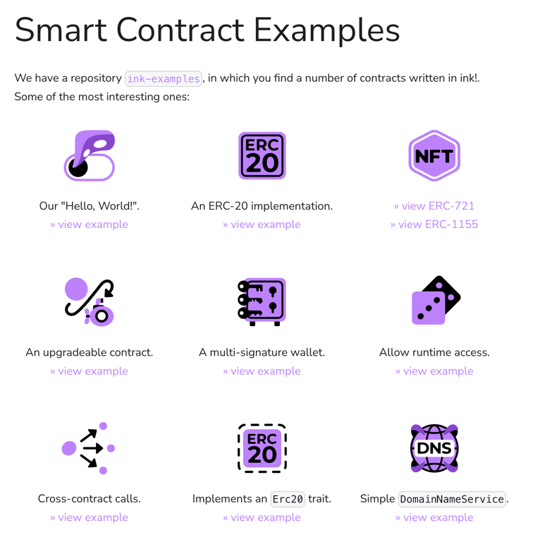

# 📣 Request for Proposals

This page is meant as a wishlist of projects we would love to see
as applications.

# 🎮 Ethernaut-inspired Web Game

[Ethernaut](https://ethernaut.openzeppelin.com/) is a Capture-The-Flag style 
game where players have to find vulnerabilities in Solidity contracts.
The contracts are given as source code and the players have to exploit them.
Once a level has been completed, the players move on to increasingly difficult 
levels.

We would very much like to see such a gamified experience for ink! contracts!
Our ideal grant application would be a web application that is just a lot of
fun to use.

We would like to see grant applications that are not just about the implementation
of this web application. Too many grant projects suffer from being dead on arrival.
Your application should have a strategy to avoid that. We would like to see a plan
for the longer term sustainability; in terms of maintenance, hosting, and promotion
of the game platform.

If your plan for long-term sustainability is to apply for treasury or grant funding,
the grant application should include an uptime of at least one year after delivery.

In terms of vulnerabilities for ink!: the usual suspects for smart contract
vulnerabilities apply to ink! as well. A good source of inspiration is the 
[Smart Contract Weakness Classification registry](https://swcregistry.io/).

## Design Guidelines

The design should fit the general ink!/squid branding and also make it 
clear that the application is part of the Polkadot ecosystem.

Our project attributes are:

* Playful, welcoming, easy to approach, inclusive, friendly.
* No straight lines/arrows: we made a point of avoiding straight
  lines in illustrations and design elements. The idea is to
  have a distinctive look from other technical projects.
* Polkadot: we want to emphasize that we are part of the Polkadot ecosystem.
  As such, the Polkadot logo should be visible and this should be clearly
  communicated.

For the graphic design you are of course free to do your own thing.
We want to mention that the illustrator who did all the artwork and design around
ink! is available for hire. You can contact him [here](https://dribbble.com/dmitrymoi).

We uploaded an extensive collection of visual ink! assets [here](https://drive.google.com/file/d/1Y4MAXwP0Fp_VvpgFpC5tYOdDZFkAbaK5/view?usp=sharing).
There are many graphical components that could already get you quite far in there.
Feel free to utilize those assets.

Most files on [use.ink](https://use.ink/) are online as an SVG, so they could also be reused directly.
The main logo can be found [here](https://use.ink/6.x/brand-assets/ink).

The fonts we use are either linked here on in the folder linked above.
Those are:

* Freude: We use this font for titles and anything where a more "interesting" font choice is needed ([example usage](https://use.ink/6.x/current-state))
* Montserrat is used as the sans serif in technical illustrations/diagrams: [Montserrat](https://fonts.google.com/specimen/Montserrat) ([example usage here](https://use.ink/img/kv.svg))
* Adobe Source Code Pro is used for monospaced text/code ([example usage](https://use.ink/assets/images/ink-substrate-e79085d5e963e7efd3ce90f17a711ba1.png)).
* Manifold: the "ink!" text in the main logo is in Manifold. You should have no need to use this font anywhere, we are just writing it out for informational purposes.

We also have a (genderless) "mascot" that is called [Squink](https://use.ink/6.x/brand-assets/ink/).
There is some backstory on it [here](https://use.ink/6.x/faq#who-is-squink).

To get an idea of the overall look and feel it's best if you click
through [use.ink](https://use.ink/).
As mentioned, our illustrator is available to create more icons, design element,
or illustrations.

We are putting a mood board of the general project vibe here as well:

